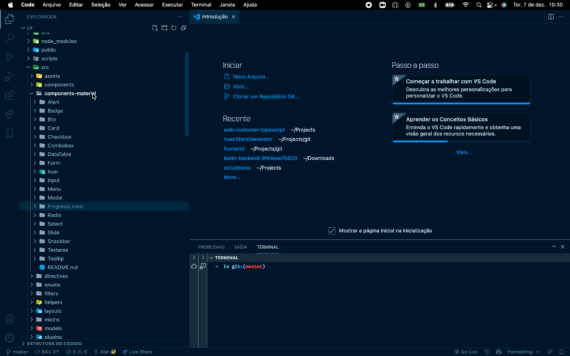

# JS+ Vue Generate Component

### A VSCode extension to generate Vue compoenets as the way we do at Juntos Somos Mais

 

## Local Running

To run local at your machine press F5

---

Inspired by @ygorazambuja 's [VuexStoreGenerator](https://github.com/ygorazambuja/VuexStoreGenerator)
