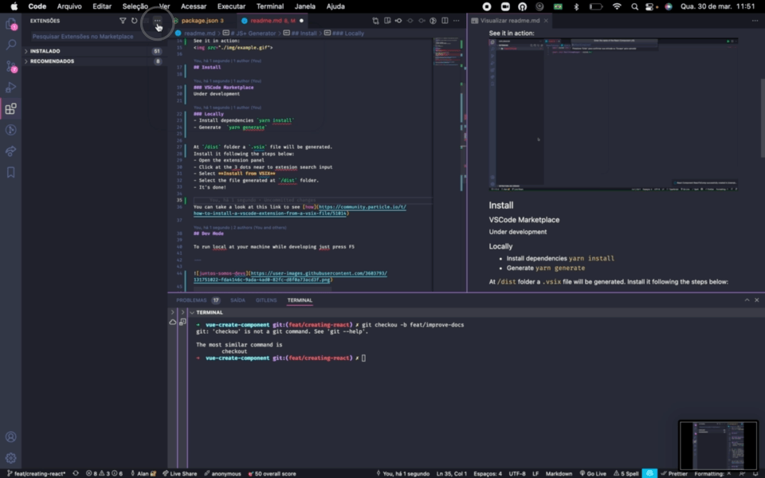

<h1 align="center"></h1>

# JS+ Generator
 A VSCode extension to generate components as the way we do at Juntos Somos Mais

### Options

- JS+ Generator: Vue Component
- JS+ Generator: Generate React Component
- JS+ Generator: Generate React Component with JavaScript

 

See it in action:

## Install

### VSCode Marketplace
[Link](https://marketplace.visualstudio.com/items?itemName=JuntosSomosMais.jsm-generator)

### Locally
- Install dependencies `yarn install`
- Generate  `yarn generate`

At `/dist` folder a `.vsix` file will be generated.
Install it following the steps below:
- Open the extension panel
- Click at the 3 dots near to extesion search input
- Select **Install from VSIX**
- Select the file generated at `/dist` folder.
- It's done!

> You can take a look at this link to see [how](https://community.particle.io/t/how-to-install-a-vscode-extension-from-a-vsix-file/51014).

Installation example:

## Dev Mode

To run local at your machine while developing just press F5

---

You also can check:
- [frontend-guideline](https://github.com/juntossomosmais/frontend-guideline) with some Front-end patterns that we use on our projects 😁
- [frontend-challenge](https://github.com/juntossomosmais/frontend-challenge) with our frontend challenge for open positions (We are hiring!) 💻

---

Inspired by [VuexStoreGenerator](https://github.com/ygorazambuja/VuexStoreGenerator)
